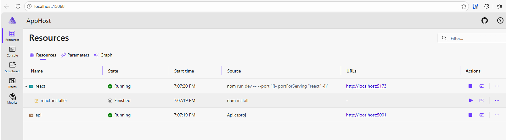
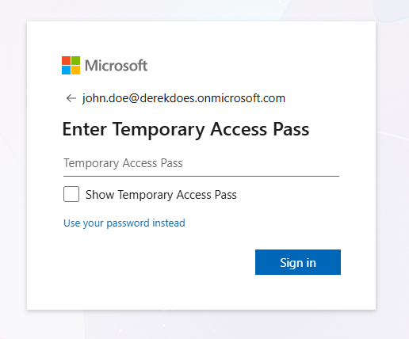
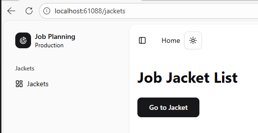
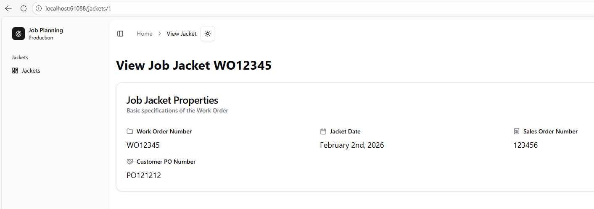
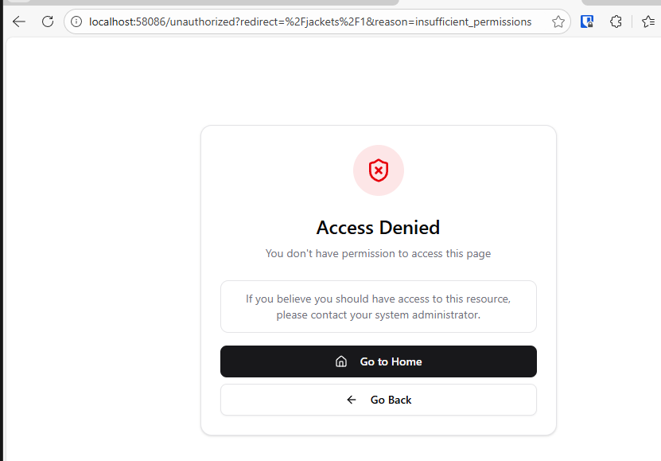

# TanStack + MSAL Troubleshooting

## Overview

This project is a sample application demonstrating TanStack Router integrated with the Microsoft Authentication Library.
I am having an issue where my authentication context doesn't appear to be initializing completely before the protected route is rendered.

This means that checks against the user's authorization fail when directly navigating to a protected route, even when the user is already authenticated in another tab.

## Reproducing the Issue

  1. Startup the Aspire App Host project
    
  2. Navigate to the home page and sign in
     - Username: `john.doe@derekdoes.onmicrosoft.com`
     - TAP: `<see discord post>` 
    
  3. Click on `Go to Jacket` button to navigate to a new protected route
     
  4. View the Jacket and Refresh the page (It should load correctly)
     
  5. Open a new browser tab and navigate directly to a protected path: [http://localhost:5173/jackets/1](http://localhost:5173/jackets/1)
     

Note that in this scenario, the user will receive an error page despite being authenticated in another tab. MSAL is not trying to silently authenticate.

## Running Locally

  1. Install .NET 10 SDK from [here](https://dotnet.microsoft.com/en-us/download/dotnet/10.0)
  2. Install Node.js from [here](https://nodejs.org/) (I am using v24.x)
  3. Clone repository
  4. Set Entra ID secrets and parameters

  ```powershell
  $domain = "derekdoes.onmicrosoft.com"
  $tenantId = "03cd471f-23fb-4e17-86a1-5fbfc84f9231"
  $clientId = "4d97f8f8-3b4f-41d0-9817-b74c24578207"
  $clientSecret = "<see discord post>"
  $authority = "https://login.microsoftonline.com/$tenantId"
  
  dotnet user-secrets set "AzureAd:Domain" $domain --project src\Api\Api.csproj
  dotnet user-secrets set "AzureAd:TenantId" $tenantId --project src\Api\Api.csproj
  dotnet user-secrets set "AzureAd:ClientId" $clientId --project src\Api\Api.csproj
  dotnet user-secrets set "AzureAd:ClientSecret" $clientSecret --project src\Api\Api.csproj
  dotnet user-secrets set "Authentication:ClientId" $clientId --project src\_aspire\AppHost\AppHost.csproj
  dotnet user-secrets set "Authentication:Authority" $authority --project src\_aspire\AppHost\AppHost.csproj
  ```

  5. Start the Aspire App Host project

  ```powershell
  dotnet run --project src\_aspire\AppHost\AppHost.csproj
  ```

## My Theories

### Race Condition on Auth Initialization
  
  **Timeline**
  - The `/_auth/jackets/$jacketId.tsx` route's `beforeLoad` is executing before the auth-provider has completed initialization.
  - This means that the `user` object is still null when the authorization check is being performed.
  - This means that that `hasPermission()` call will return false and immeidately redirect the user

  **Questions**
  - The `/_auth/route.tsx` has a guard within its `beforeLoad` that checks for `isInitialized` and manually hydrates the account data
  - This logic should execute before any child routes begin executing, preventing missing data further down

## Other Notes

I'm not very familiar with React or TanStack Router. I'd appreciate any other guidance or suggestions on making a robust authz flow for this application. Thank you!